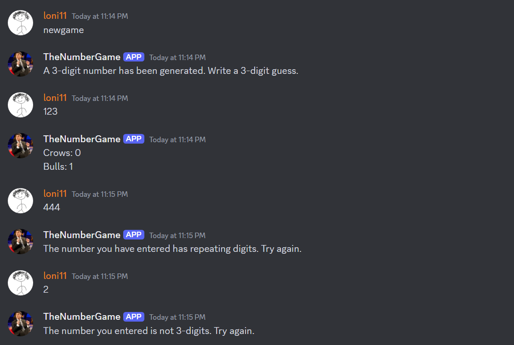
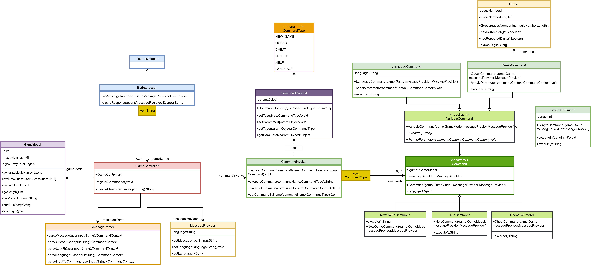

# Discord-Bot-Number-Game-

Bulls and Cows game implemented as a Discord Bot with java using Discords' API. 
The bot generates a number, and you have to keep guessing which is the correct number. After each guess the bot tells you how many digits are contained in the hidden number(bulls), and how many are in the correct position(cows). You can change the length of the hidden number, change the language, or cheat when you can't find the solution. Below are all the commands that you can type to the bot. 

Commands: 
- newgame
- length
- help
- cheat
- language

Use the following link to invite the bot to your discord server: https://discord.com/oauth2/authorize?client_id=1158407551608688711er

## Demo

     
      
    

## UML class architecture

   

